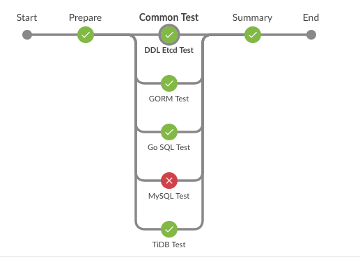
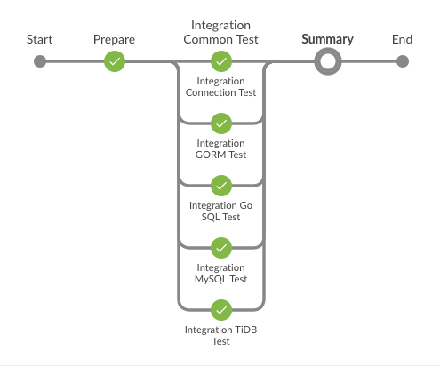
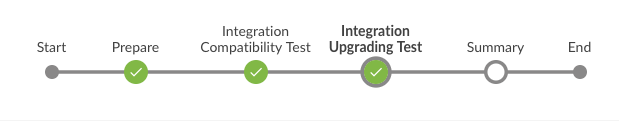
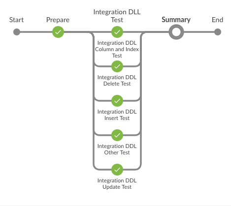
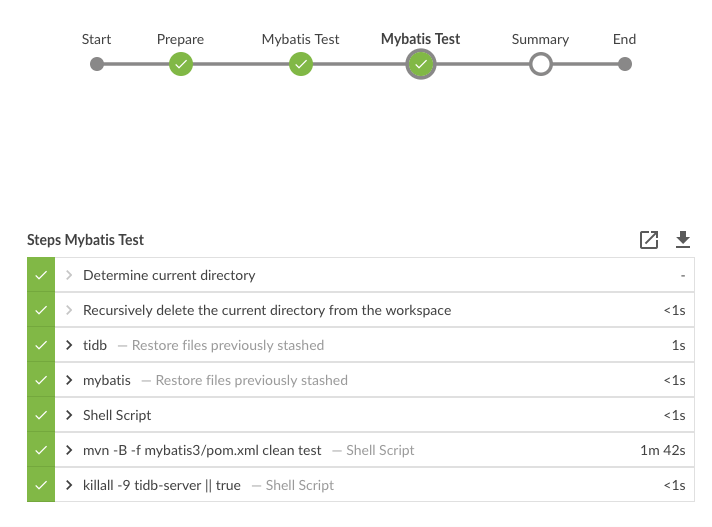
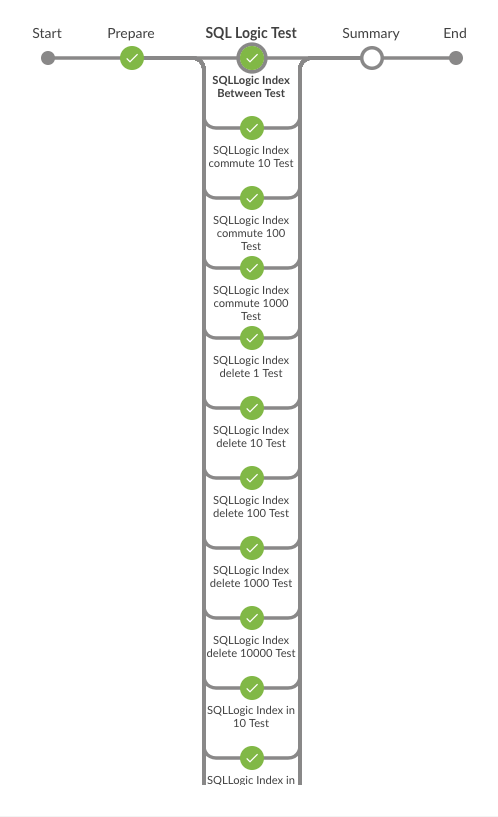

目前看来，tidb项目最关键的是Query Optimizer和测试流程
- 前者决定这个数据库的上限，后者决定数据库的下线
- 前者的文档还有代码都比较多，而后者是不开源的，下面记录目前收集到的tidb测试的信息

# 信息来源
- [和 PingCAP CTO 畅谈数据库和编程语言](http://teahour.fm/2017/11/22/new-database-go-and-rust-with-cto-of-pingcap.html)
- [TiDB 架构的演进和开发哲学](https://zhuanlan.zhihu.com/p/25142743/)
- [分布式系统测试那些事儿 - 理念](https://pingcap.com/blog-cn/distributed-system-test-1/)
- [tidb jenkins blue ocean](http://45.249.247.133:8080/blue/organizations/jenkins/pipelines)
- [tidb](https://github.com/pingcap/tidb)
- [pd](https://github.com/pingcap/pd)
- [tikv](https://github.com/pingcap/tikv)

# 测试流程
tidb有push和pr会执行一系列的test，除了`/run-all-tests`,还能跑特定的一系列测试（如`/run-sqllogic-test`）:
- tidb
	- ci/circleci
		- `make dev`
		- `dev: checklist parserlib test check`
		- 看起来只是跑单元测试
	- continuous-integration/travis-ci/pr
		- 命令和circleci一样，运行的都是`make dev`，不知道这种冗余是为什么？
	- jenkins-ci-tidb/build
		- tikv，pd，tidb的Jenkinsfile都应用了`git@github.com:pingcap/SRE.git`
		- 不过这个项目不是开源的，下面通过jenkins的log看具体在跑什么	
    - jenkins-ci-tidb/common-test
    - jenkins-ci-tidb/unit-test
    - jenkins-ci-tidb/integration-common-test
    - jenkins-ci-tidb/integration-compatibility-test
    - jenkins-ci-tidb/integration-ddl-test
    - jenkins-ci-tidb/mybatis-test
    - jenkins-ci-tidb/sqllogic-test
- tikv
	- ci/circleci
	- jenkins-ci-tikv/build
	- jenkins-ci-tikv/integration-common-test
	- jenkins-ci-tikv/integration-compatibility-test
	- jenkins-ci-tikv/integration-ddl-test
	- jenkins-ci-tikv/unit-test
- pd
	- ci/circleci
    - continuous-integration/travis-ci/pr
    - jenkins-ci-pd/build


```groovy
node {
    def TIDB_TEST_BRANCH = "master"
    def TIDB_BRANCH = "master"
    def PD_BRANCH = "master"

    fileLoader.withGit('git@github.com:pingcap/SRE.git', 'master', 'github-iamxy-ssh', '') {
        fileLoader.load('jenkins/ci/pingcap_tikv_branch.groovy').call(TIDB_TEST_BRANCH, TIDB_BRANCH, PD_BRANCH)
    }
}
```

# tidb 内部的Jenkins服务器

通过github的pr能看到pingcap内部jenkins的log，想到的第一件事就是怎么攻击这台服务器，可以看到22端口和8080端口是开放的，ssh攻击就不弄了，
还能看到pingcap的jenkins的版本没有更新安全更新，不过没有想到怎么利用这一点

## `jenkins-ci-tidb/build`

主要是`make parser`,`make build`,之后用`filemgr-linux64 ....`上传

## `jenkins-ci-tidb/common-test`



主要是用mysql的driver连上tidb来测试

运行5个并行的stage：
- DDL Etcd Test
- GORM Test
- Go SQL Test
- MySQL Test
- TiDB Test

## `jenkins-ci-tidb/unit-test`

- unit test
- race test
- leak test

## `jenkins-ci-tidb/integration-common-test`



## `jenkins-ci-tidb/integration-compatibility-test`



## `jenkins-ci-tidb/integration-ddl-test`



## `jenkins-ci-tidb/mybatis-test`



## `jenkins-ci-tidb/sqllogic-test`


