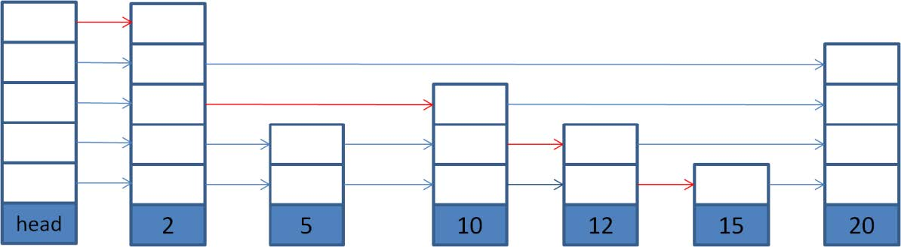

# leveldb 实现解析 

--------------
- original by 那岩(neveray@gmail.com) @2011-12
- format and minor edit by biolee @2017-10

leveldb 是 Google 开源的持久化 KV 单机存储引擎, 针对存储面对的普遍随机 IO 问题，leveldb 采用了 merge-dump 的方式，将逻辑场景的写请求转换成顺序写log 和写 memtable 操作，由后台进程将 memtable 持久化成 sstable。

对于读请求，随机 IO 还是无法避免，但它设计了一系列策略来保证读的效率。

这里对 leveldb 的实现做具体解析，但并不采用对代码注释的方式，而是意图从上层设计的角度，将内部的实现逻辑串联起来，尽量发现策略设计背后的原因。

# 代码目录结构

- doc/ 
	- 相关文档。有 log 和 sstable 的格式介绍（log_format/table_format）
- include/leveldb/
	- 使用者需要的头文件，包含基本的接口,可以自定义的 comparator/env/cache，以及依赖的头文件。
- db/
	- 主要逻辑的实现。包括
		- 接口的实现（db_impl/db_iter）
		- 内部结构的定义（dbformat/memtable/skiplist/write_batch），
		- db 运行状态以及
		- 操作的包装（version_set/version_edit），
		- log 格式相关（log/log_reader/log_writer)
		- filename 处理相关（filename）
		- sstable 相关（builder/table_cache）
- table/
	- sstable 相关的数据格式定义以及操作实现。
	- 格式定义（format）
	- block 相关的操作（block/block_builder）
	- sstable 相关的操作（table/table_builder）
	- 操作便利封装的复合 Iterator(two_level_iterator/ merger)
	- 优化Iterator 的 wrapper（iterator_wrapper）。
- port/
	- 根据系统环境，为移植实现的锁/信号/原子操作/压缩相关。提供 posix/android。
- util/
	- 提供的通用功能实现。
	- memtable 使用的简单内存管理（arena）
	- LRU cache 的实现（cache）
	- comparator 的默认实现（comparator）
	- 通用功能的实现（coding/crc32c/hash/random/MutexLock/logging）
	- leveldb将文件/进程相关的操作封装成 Env，提供了默认的实现（env_posix）。
- helper/memenv/ 
	- 实现了一个简单的完全内存的文件系统，提供操作目录文件的接口。

# 基本概念

## Slice (include/leveldb/slice.h)

为操作数据的方便，将数据和长度包装成 Slice 使用，直接操控指针避免不必要的数据拷贝。

```cpp
class Slice {
private:
	const char* data_; size_t size_;
};
```


## Option （include/leveldb/option.h）

leveldb 中启动时的一些配置，通过 Option 传入，get/put/delete 时，也有相应的ReadOption/WriteOption。
```c
// include/leveldb/option.h 
struct Options {
	// 传入的 comparator
	const Comparator* comparator;
	
	// open 时，如果 db 目录不存在就创建 
	bool create_if_missing;
	
	// open 时，如果 db 目录存在就报错 
	bool error_if_exists;
	
	// 是否保存中间的错误状态(RecoverLog/compact),compact 时是否读到的 block 做检验。
	bool paranoid_checks;
	
	// 传入的 Env。 
	Env* env;
	
	// 传入的打印日志的 Logger 
	Logger* info_log;
	
	// memtable 的最大 size
	size_t write_buffer_size;
	
	// db 中打开的文件最大个数
	// db 中需要打开的文件包括基本的 CURRENT/LOG/MANIFEST/LOCK, 以及打开的 sstable 文件。
	// sstable 一旦打开，就会将 index 信息加入 TableCache，所以把
	// (max_open_files - 10)作为 table cache 的最大数量. 
	int max_open_files;
	
	// 传入的 block 数据的 cache 管理 
	Cache* block_cache;
	
	// sstable 中 block 的 size 
	size_t block_size;
	
	// block 中对 key 做前缀压缩的区间长度
	int block_restart_interval;
	
	// 压缩数据使用的压缩类型（默认支持 snappy，其他类型需要使用者实现） 
	CompressionType compression;
}

// include/leveldb/option.h 
struct ReadOptions {
	// 是否对读到的 block 做校验
	bool verify_checksums;
	
	// 读到的 block 是否加入 block cache 
	bool fill_cache;
	
	// 指定读取的 SnapShot
	const Snapshot* snapshot;
}

// include/leveldb/option.h 
struct WriteOptions {
	// write 时，记 binlog 之后，是否对 binlog 做 sync。
	bool sync;
	
	// 如果传入不为 NULL，write 完成之后同时做 SnapShot. 
	const Snapshot** post_write_snapshot;
}

// 另外还有一些编译时的常量，与 Option 一起控制。
// db/dbformat.h 
namespace config {
	// level 的最大值
	static const int kNumLevels = 7;

	// level-0 中 sstable 的数量超过这个阈值，触发 compact static 
	const int kL0_CompactionTrigger = 4;
	
	// level-0 中 sstable 的数量超过这个阈值, 慢处理此次写(sleep1ms）
	static const int kL0_SlowdownWritesTrigger = 8;
	
	// level-0 中 sstable 的数量超过这个阈值, 阻塞至 compact memtable 完成。 
	static const int kL0_StopWritesTrigger = 12;
	
	// memtable dump 成的 sstable，允许推向的最高 level
	// （参见 Compact 流程的 VersionSet::PickLevelForMemTableOutput()） 
	static const int kMaxMemCompactLevel = 2;
}

// db/version_set.cc 
namespace leveldb {
	// compact 过程中，level-0 中的 sstable 由 memtable 直接 dump 生成，不做大小限制
	// 非 level-0 中的 sstable 的大小设定为 kTargetFileSize static const 
	int kTargetFileSize = 2 * 1048576;
	
	// compact level-n 时，与 level-n+2 产生 overlap 的数据 size （参见 Compaction） 
	static const int64_t kMaxGrandParentOverlapBytes = 10 * kTargetFileSize;
}
```


## Env （include/leveldb/env.h util/env_posix.h）

考虑到移植以及灵活性，leveldb 将系统相关的处理（文件/进程/时间之类）抽象成 Env，用户可以自己实现相应的接口，作为 Option 传入。默认使用自带的实现。

## varint (util/coding.h)

leveldb 采用了 protocalbuffer 里使用的变长整形编码方法，节省空间。

## ValueType （db/dbformat.h）
leveldb 更新（put/delete）某个 key 时不会操控到 db 中的数据，每次操作都是直接新插入一份 kv 数据，具体的数据合并和清除由后台的 compact 完成。
所以，每次 put，db 中就会新加入一份 KV 数据，即使该 key 已经存在；而 delete 等同于 put 空的 value。为了区分真实 kv 数据和删除操作的 mock 数据，使用 ValueType 来标识：
```c
enum ValueType { 
	kTypeDeletion = 0x0, 
	kTypeValue = 0x1
};
```

## SequnceNnumber （db/dbformat.h）
leveldb 中的每次更新（put/delete)操作都拥有一个版本，由 SequnceNumber 来标识，整个 db 有一个全局值保存着当前使用到的 SequnceNumber。
SequnceNumber 在 leveldb 有重要的地位，key 的排序，compact 以及 snapshot 都依赖于它。 typedef uint64_t SequenceNumber;
存储时，SequnceNumber 只占用 56 bits, ValueType 占用 8 bits，二者共同占用 64bits（uint64_t).

|0              |          56|
|---------------|------------|
|SequnceNumber  |   ValueType|

## user key
用户层面传入的 key，使用 Slice 格式。

## ParsedInternalKey （db/dbformat.h）
db 内部操作的 key。db 内部需要将 user key 加入元信息(ValueType/SequenceNumber)一并做处理。 
```c
struct ParsedInternalKey {
	Slice user_key; 
	SequenceNumber sequence; 
	ValueType type;
};
```


## InternalKey (db/dbformat.h)

db 内部，包装易用的结构，包含 userkey 与 SequnceNumber/ValueType。

## LookupKey (db/dbformat.h)

db 内部在为查找 memtable/sstable 方便，包装使用的 key 结构，保存有 userkey 与 SequnceNumber/ValueType dump 在内存的数据。

```c
class LookupKey {
private:
	const char* start_; 
	const char* kstart_; 
	const char* end_;
};
```

LookupKey:
|start|kstart|end|
|----|------|----|
|userkey_len(varint32)|userkey_data(userkey_len)|SequnceNumber/ValueType(uint64)|

对 memtable 进行 lookup 时使用 [start,end], 对 sstable lookup 时使用[kstart, end]。

# Comparator （include/leveldb/comparator.h util/comparator.cc）

对 key 排序时使用的比较方法。leveldb 中 key 为升序。
用户可以自定义 user key 的 comparator（user-comparator)，作为 option 传入，默认采用 byte compare（memcmp）。
comparator 中有 FindShortestSeparator（）/ FindShortSuccessor（）两个接口，
FindShortestSeparator（start，limit）是获得大于 start 但小于 limit 的最小值。 
FindShortSuccessor（start）是获得比 start 大的最小值。比较都基于 user-commparator，二者会被用来确定 sstable 中 block 的 end-key。

## InternalKeyComparator (db/dbformat.h)
db 内部做 key 排序时使用的比较方法。排序时，会先使用 user-comparator 比较 user-key, 
如果 user-key 相同，则比较 SequnceNumber，SequnceNumber 大的为小。
因为 SequnceNumber 在 db 中全局递增，所以，对于相同的 user-key，最新的更新（SequnceNumber 更大）排在前面，在查找的时候，会被先找到。
InternalKeyComparator 中 FindShortestSeparator（）/ FindShortSuccessor（）的实现，仅从传入的内部 key 参数，解析出 user-key，然后再调用 user-comparator 的对应接口。

## WriteBatch （db/write_batch.cc）
对若干数目 key 的 write 操作（put/delete）封装成 WriteBatch。它会将 userkey 连同
SequnceNumber 和 ValueType 先做 encode，然后做 decode，将数据 insert 到指定的 Handler
（memtable）上面。上层的处理逻辑简洁，但 encode/decode 略有冗余。 WriteBatch encode 之后，内部保存的数据格式：

``` table
SequnceNumber
(uint64)
count
(uint32)
record0
......
recordN

```

record 组成：

```table
image
ValueType
（char）
key_len
(varint32)
key_data
(key_len)
value_len (varint32)

value_data (value_len)
```

1. SequnceNumber: WriteBatch 中开始使用的 SequnceNumber。
2. count: 批量处理的 record 数量
3. record：封装在 WriteBatch 内的数据。

如果 ValueType 是 kTypeValue,则后面有 key 和 value如果 ValueType 是 kTypeDeletion，则后面只有 key。

## Memtable (db/memtable.cc db/skiplist.h)
db 数据在内存中的存储格式。
- 写操作的数据都会先写到 memtable 中。
- memtable 的 size 有限制最大值（write_buffer_size)。
- memtable 的实现是 skiplist。
- 当一个 memtable size 到达阈值时，会变成只读的 memtable（immutable memtable），同时生成一个新的 memtable 供新的写入。后台的 compact 进程会负责将 immutable memtable dump 成 sstable。所以，同时最多会存在两个 memtable（正在写的 memtable 和 immutable memtable）。

# Sstable (table/table.cc)
db 数据持久化的文件。

文件的 size 有限制最大值（kTargetFileSize)。文件前面为数据，后面是索引元信息。

## FileMetaData （db/version_edit.h）
```c
// sstable 文件的元信息封装成 FileMetaData
struct FileMetaData {
	// 引 用 计 数
	int refs; 
	
	// compact 之前允许的 seek 次数（参见 Version） 
	int allowed_seeks; 
	
	// FileNumer
	uint64_t number; 
	
	// 文件的 size 
	uint64_t file_size; 
	
	// sstable 文件的最小 key 
	InternalKey smallest; 
	
	// sstable 文件的最大 key
	InternalKey largest; 
};

```

## block (table/block.cc)
sstable 的数据由一个个的 block 组成。当持久化数据时，多份 KV 聚合成 block 一次写入；当读取时，也是以 block 单位做 IO。sstable 的索引信息中会保存符合 key-range 的 block 在文件中的
offset/size（BlockHandle）。

## BlockHandle(table/format.h)
block 的元信息（位于 sstable 的 offset/size）封装成 BlockHandle。

## FileNumber（db/dbformat.h）
db 创建文件时会按照规则将 FileNumber 加上特定后缀作为文件名。所以，运行时只需要记录
FileNumber（uint64_t)即可定位到具体的文件路径，省掉了字符串的麻烦。FileNumber 在 db 中全局递增。

## filename (db/filename.cc)
db 中的文件用文件名区分类型。有以下几种类型 
```c
enum FileType {
	kLogFile, 
	kDBLockFile, 
	kTableFile, 
	kDescriptorFile, 
	kCurrentFile, 
	kTempFile,
	kInfoLogFile // Either the current one, or an old one
};
```

1. kLogFile 日志文件：[0-9]+.log
	- leveldb 的写流程是先记 binlog，然后写 sstable，该日志文件即是 binlog。前缀数字为FileNumber。
2. kDBLockFile，lock 文件：LOCK
	- 一个 db 同时只能有一个 db 实例操作，通过对 LOCK 文件加文件锁（flock）实现主动保护。 3） kTableFile，sstable 文件：[0-9]+.sst
3. 保存数据的 sstable 文件。前缀为 FileNumber。
4. kDescriptorFile，db 元信息文件：MANIFEST-[0-9]+
	- 每当 db 中的状态改变（VersionSet），会将这次改变（VersionEdit）追加到 descriptor 文件中。后缀数字为 FileNumber。
5. kCurrentFile，：CURRENT
	- CURRENT 文件中保存当前使用的 descriptor 文件的文件名。
6. kTempFile，临时文件：[0-9]+.dbtmp
	- 对 db 做修复（Repairer）时，会产生临时文件。前缀为 FileNumber。
7. kInfoLogFile，db 运行时打印日志的文件：LOG
	- db 运行时，打印的 info 日志保存在 LOG 中。每次重新运行，如果已经存在 LOG 文件，会先将 LOG文件重名成 LOG.old
	
## level-n (db/version_set.h)

为了均衡读写的效率，sstable 文件分层次（level）管理，db 预定义了最大的 level 值。compact 进程负责 level 之间的均衡。

## Compact (db/db_impl.cc db/version_set.cc)
- compact 后台进程
	- db 中有一个 compact 后台进程，负责将 memtable 持久化成 sstable，以及均衡整个 db 中各 level 的 sstable。 
	- Comapct 进程会优先将已经写满的 memtable dump 成 level-0 的 sstable（不会合并相同key 或者清理已经删除的 key）
	- 然后，根据设计的策略选取 level-n 以及 level-n+1 中有 key-range overlap 的几个 sstable 进行 merge(期间会合并相同的 key 以及清理删除的 key），最后生成若干个 level-(n+1)的 ssatble。
	- 随着数据不断的写入和 compact 的进行，低 level 的 sstable 不断向高level 迁移。
	- level-0 中的 sstable 因为是由 memtable 直接 dump 得到，所以 key-range 可能 overlap，而 level-1 以及更高 level 中的 sstable 都是做 merge 产生，保证了位于同 level 的 sstable 之间， key-range 不会 overlap，这个特性有利于读的处理。

# Compaction(db/version_set.cc)
compact 信息的封装。 
```c
class Compaction {
	// 要 compact 的 level
	int level_; 
	
	// 生成 sstable 的最大 size (kTargetFileSize) 
	uint64_t max_output_file_size_; 
	
	// compact 时当前的 Version
	Version* input_version_; 
	
	// 记录 compact 过程中的操作
	VersionEdit edit_; 
	
	// inputs_[0]为 level-n 的 sstable 文件信息，
	// inputs_[1]为 level-n+1 的 sstable 文件信息 
	std::vector<FileMetaData*> inputs_[2];
	
	// 位于 level-n+2，并且与 compact 的 key-range 有 overlap 的 sstable。
	// 保存 grandparents_是因为 compact 最终会生成一系列 level-n+1 的 sstable，
	// 而如果生成的 sstable 与 level-n+2 中有过多的 overlap 的话，当 compact
	// level-n+1 时，会产生过多的 merge，为了尽量避免这种情况，compact 过程中
	// 需要检查与 level-n+2 中产生 overlap 的 size 并与
	// 阈值 kMaxGrandParentOverlapBytes 做比较，
	// 以便提前中止 compact。 
	std::vector<FileMetaData*> grandparents_;
	
	// 记录 compact 时 grandparents_中已经 overlap 的 index 
	size_t grandparent_index_;
	
	// 记录是否已经有 key 检查 overlap
	// 如果是第一次检查，发现有 overlap，也不会增加 overlapped_bytes_.
	// (没有看到这样做的意义） bool seen_key_;
	// 记录已经 overlap 的累计 size 
	int64_t overlapped_bytes_;
	
	// compact 时，当 key 的 ValueType 是 kTypeDeletion 时，
	// 要检查其在 level-n+1 以上是否存在（IsBaseLevelForKey()）
	// 来决定是否丢弃掉该 key。因为 compact 时，key 的遍历是顺序的，
	// 所以每次检查从上一次检查结束的地方开始即可，
	// level_ptrs_[i]中就记录了 input_version_->levels_[i]中，上一次比较结束的
	// sstable 的容器下标。
	size_t level_ptrs_[config::kNumLevels];
};
```
## Version (db/version_set.cc)
将每次 compact 后的最新数据状态定义为 Version，也就是当前 db 元信息以及每个 level 上具有最新数据状态的 sstable 集合。compact 会在某个 level 上新加入或者删除一些 sstable，但可能这个时候，那些要删除的 sstable 正在被读，为了处理这样的读写竞争情况，基于 sstable 文件一旦生成就不会
改动的特点，每个 Version 加入引用计数，读以及解除读操作会将引用计数相应加减一。这样， db 中可能有多个 Version 同时存在（提供服务），它们通过链表链接起来。当 Version 的引用计数为 0 并且不是当前最新的 Version 时，它会从链表中移除，对应的，该 Version 内的 sstable 就可以删除了
（这些废弃的 sstable 会在下一次 compact 完成时被清理掉）。 
```c
class Version {
	// 属于的 VersionSet 
	VersionSet* vset_;
	
	// 链表指针 
	Version* next_; 
	Version* prev_;
	
	// 引用计数
	int refs_;
	
	// 每个 level 的所有 sstable 元信息。
	// files_[i]中的 FileMetaData 按照 FileMetaData::smallest 排序，
	// 这是在每次更新都保证的。（参见 VersionSet::Builder::Save()） 
	std::vector<FileMetaData*> files_[config::kNumLevels];
	
	// 需要 compact 的文件（allowed_seeks 用光） 
	FileMetaData* file_to_compact_;
	
	// file_to_compact_的 level 
	int file_to_compact_level_;
	
	// 当前最大的 compact 权重以及对应的 level 
	double compaction_score_;
	int compaction_level_;
};
```

Version 中与 compact 相关的有 file_to_compact_/ file_to_compact_level_，compaction_score_/ compaction_level_，这里详细说明他们的意义。

1. compaction_score_

leveldb 中分 level 管理 sstable，对于写，可以认为与 sstable 无关。

而基于 get 的流程（参见get 流程），各 level 中的 sstable 的 count，size 以及 range 分布，会直接影响读的效率。可以预想的最佳情形可能是 level-0 中最多有一个 sstable，level-1 以及之上的各 level 中 key-range 分布均匀，期望更多的查找可以遍历最少的 level 即可定位到。
将这种预想的最佳状态定义成: level 处于均衡的状态。当采用具体的参数量化，也就量化了各个level 的不均衡比重，即 compact 权重： score。score 越大，表示该 level 越不均衡，需要更优先进行 compact。
每个 level 的具体均衡参数及比重计算策略如下：

- level-0
	- 因为 level-0 的 sstable range 可能 overlap，所以如果 level-0 上有过多的 sstable，在做查找时，会严重影响效率。
	- 同时，因为 level-0 中的 sstable 由 memtable 直接 dump 得到，并不受kTargetFileSize（生成 sstable 的 size）的控制，所以 sstable 的 count 更有意义。
	- 基于此，对于 level-0，均衡的状态需要满足：sstable 的 count < kL0_CompactionTrigger。 score = sstable 的 count/ kL0_CompactionTrigger。
	- 为了控制这个数量， 另外还有 kL0_SlowdownWritesTrigger/kL0_StopWritesTrigger 两个阈值来主动控制写的速率（参见 put 流程）。
- level-n(n>=1)
	- 对于 level-1 及以上的 level，sstable 均由 compact 过程产生， 生成的 sstable 大小被kTargetFileSize 控制， 所以可以 限定 sstable 总的 size 。
	- 当前的策略是设置初 始值 kBaseLevelSize，然后以 10 的指数级按 level 增长。
	- 每个 level 可以容纳的 quota_size = kBaseLevelSize * 10^(level_number-1) 。
	- 所以 level-1 可以容纳总共 kBaseLevelSize 的 sstable，level-2 允许 `kBaseLevelSize*10`
	- 基于此，对于 level-1 及以上的 level均衡的状态需要满足：
		- sstable 的 `size < quota_size`
		- score = sstable 的 `size / quota_size`。

每次 compact 完成，生效新的 Version 时（VersionSet::Finalize()），都会根据上述的策略，计算出每个 level 的 score,取最大值作为当前 Version 的 compaction_score_,同时记录对应的level(compaction_level_)。

2. file_to_compact_

leveldb 对单个 sstable 文件的 IO 也做了细化的优化，设计了一个巧妙的策略。

首先，一次查找如果对多于一个 sstable 进行了查找（对 sstable 进行了查找可以认为对其中的datablock 进行了一次寻道 seek），说明处于低 level 上的 sstable 并没有提供高的 hit 比率，可以认为它处在不最优的情况，而我们认为 compact 后会倾向于均衡的状态，所以在一个 sstable 的seek 次数达到一定阈值后，主动对其进行 compact 是合理的。
这个具体 seek 次数阈值(allowed_seeks)的确定，依赖于 sas 盘的 IO 性能：

- 一次磁盘寻道 seek 耗费 10ms。
- 读或者写 1M 数据耗费 10ms （按 100M/s IO 吞吐能力）。
- compact 1M 的数据需要 25M 的 IO：从 level-n 中读 1M 数据，从 level-n+1 中读 10～12M 数据，写入 level-n+1 中 10～12M 数据。
	
所以，compact 1M 的数据的时间相当于做 25 次磁盘 seek，反过来说就是，1 次 seek 相当于 compact 40k 数据。那么，可以得到 seek 阈值 allowed_seeks=sstable_size / 40k。
保守设置，当前实际的 allowed_seeks = sstable_size / 16k。每次 compact 完成，构造新的 Version 时（Builder::Apply()）,每个 sstable 的 allowed_seeks 会计算出来保存在 FileMetaData。
在每次 get 操作的时候，如果有超过一个 sstable 文件进行了查找，会将第一个进行查找的sstable 的 allowed_seeks 减一，并检查其是否已经用光了 allowed_seeks,若是，则将该 sstable记录成当前 Version 的 file_to_compact_,并记录其所在的 level(file_to_compact_level_)。

## VersionSet （db/version_set.cc）
整个 db 的当前状态被 VersionSet 管理着，其中有当前最新的 Version 以及其他正在服务的 Version链表；全局的 SequnceNumber，FileNumber；当前的 manifest_file_number; 封装 sstable 的
TableCache。 每个 level 中下一次 compact 要选取的 start_key 等等。
```c
VersionSet {
	// 实 际 的 Env 
	Env* const env_;
	
	// db 的数据路径
	const std::string dbname_;
	
	// 传入的 option
	const Options* const options_;
	
	// 操作 sstable 的 TableCache 
	TableCache* const table_cache_;
	
	// comparator
	const InternalKeyComparator icmp_;
	
	// 下一个可用的 FileNumber 
	uint64_t next_file_number_;
	
	// manifest 文件的 FileNumber
	uint64_t manifest_file_number_;
	
	// 最后用过的 SequnceNumber 
	uint64_t last_sequence_;
	
	// log 文件的 FileNumber
	uint64_t log_number_;
	
	// 辅助 log 文件的 FileNumber，在 compact memtable 时，置为 0. 
	uint64_t prev_log_number_;
	
	// manifest 文件的封装 
	WritableFile* descriptor_file_;
	
	// manifest 文件的 writer 
	log::Writer* descriptor_log_;
	
	// 正在服务的 Version 链表 
	Version dummy_versions_;
	
	// 当前最新的的 Version
	Version* current_;
	
	// 为了尽量均匀 compact 每个 level，所以会将这一次 compact 的 end-key 作为
	// 下一次 compact 的 start-key。compactor_pointer_就保存着每个 level
	// 下一次 compact 的 start-key.
	// 除了 current_外的 Version，并不会做 compact，所以这个值并不保存在 Version 中。 
	std::string compact_pointer_[config::kNumLevels];
}
```
## VersionEdit(db/version_edit.cc)
compact 过程中会有一系列改变当前 Version 的操作（FileNumber 增加，删除 input 的 sstable，增加输出的 sstable……），为了缩小 Version 切换的时间点，将这些操作封装成 VersionEdit，compact完成时，将 VersionEdit 中的操作一次应用到当前 Version 即可得到最新状态的 Version。
```c
struct VersionEdit {
	typedef std::set< std::pair<int, uint64_t> > DeletedFileSet;
	
	// db 一旦创建，排序的逻辑就必须保持兼容，用 comparator 的名字做凭证 
	std::string comparator_;
	
	// log 的 FileNumber 
	uint64_t log_number_;
	
	// 辅助 log 的 FileNumber
	uint64_t prev_log_number_;
	
	// 下一个可用的 FileNumber 
	uint64_t next_file_number_;
	
	// 用过的最后一个 SequnceNumber
	SequenceNumber last_sequence_;
	
	// 标识是否存在，验证使用 
	bool has_comparator_; 
	bool has_log_number_;
	bool has_prev_log_number_; 
	bool has_next_file_number_; 
	bool has_last_sequence_;
	
	// 要更新的 level ==》 compact_pointer。
	std::vector< std::pair<int, InternalKey> > compact_pointers_;
	
	// 要删除的 sstable 文件（compact 的 input） 
	DeletedFileSet deleted_files_;
	
	// 新的文件（compact 的 output）
	std::vector< std::pair<int, FileMetaData> > new_files_;
}
```

每次 compact 之后都会将对应的 VersionEdit encode 入 manifest 文件。

## VersionSet::Builder (db/version_set.cc)
将 VersionEdit 应用到 VersonSet 上的过程封装成 VersionSet::Builder.主要是更新 Version::files_[].
```cpp
class VersionSet::Builder {
	// 处理 Version::files_[i]中 FileMetaData 的排序 
	struct BySmallestKey {
		const InternalKeyComparator* internal_comparator;

		bool operator()(FileMetaData* f1, FileMetaData* f2) const {
			int r = internal_comparator->Compare(f1->smallest, f2->smallest); 
			if (r != 0) {
				return (r < 0);
			} else {
				// Break ties by file number 
				return (f1->number < f2->number);
			}
		}
	};

	// 排序的 sstable（FileMetaData）集合
	typedef std::set<FileMetaData*, BySmallestKey> FileSet;
	
	// 要添加和删除的 sstable 文件集合 
	struct LevelState {
		std::set<uint64_t> deleted_files; 
		FileSet* added_files;
	};
	
	// 要更新的 VersionSet 
	VersionSet* vset_;
	
	// 基准的 Version，compact 后，将 current_传入作为 base。
	Version* base_;
	
	// 各个 level 上要更新的文件集合（LevelStat）
	// compact 时，并不是每个 level 都有更新（level-n/level-n+1）。 
	LevelState levels_[config::kNumLevels];
}；
```

以 base_->files_[level]为基准，根据 levels_中 LevelStat 的 deleted_files/added_files 做 merge，输出到新 Version 的 files_[level] (VersionSet::Builder::SaveTo()).

1. 对于每个 level n， `base_->files_[n]`与 `added_files` 做 merge，输出到新 Version 的 `files_[n]`中。过程中根据 deleted_files 将要删除的丢弃掉（ `VersionSet::Builder::MaybeAddFile()`）
2. 处理完成，新 Version 中的 `files_[level]`有了最新的 sstable 集合（FileMetaData）

## Manifest（descriptor）（db/version_set.cc）

为了重启 db 后可以恢复退出前的状态，需要将 db 中的状态保存下来，这些状态信息就保存在manifeest 文件中。

当 db 出现异常时，为了能够尽可能多的恢复，manifest 中不会只保存当前的状态，而是将历史的状态都保存下来。又考虑到每次状态的完全保存需要的空间和耗费的时间会较多，当前采用的方式是，只在 manifest 开始保存完整的状态信息（VersionSet::WriteSnapshot（）），接下来只保存每次
compact 产生的操作（VesrionEdit），重启 db 时，根据开头的起始状态，依次将后续的 VersionEdit replay，即可恢复到退出前的状态（Vesrion）。

## TableBuilder/BlockBuilder(table/table_builder.cc table/block_builder.cc)
生成 block 的过程封装成 BlockBuilder 处理。生出 sstable 的过程封装成 TableBuilder 处理。

## Iterator (include/leveldb/iterator.h)
leveldb 中对 key 的查找和遍历，上层统一使用 Iterator 的方式处理，屏蔽底层的处理，统一逻辑。提供 RegisterCleanup()可以在 Iterator 销毁时，做一些清理工作（比如释放 Iterator 持有句柄的引用）。

# 存储结构的格式定义与操作

以下存储结构层面提到的 key，如非特别说明，均指已经包含 SequnceNumber/valueType 的 Internalkey:

|user-key|SequnceNumber(with ValueType)|

## memtable (db/skiplist.h db/memtable)

类似 BigTable 的模式，数据在内存中以 memtable 形式存储。leveldb 的 memtable 实现没有使用复杂的 B-树系列，采用的是更轻量级的 skip list。

全局看来，skip list 所有的 node 就是一个排序的链表，考虑到操作效率，为这一个链表再添加若干不同跨度的辅助链表，查找时通过辅助链表可以跳跃比较来加大查找的步进。每个链表上都是排序的 node，而每个 node 也可能同时处在多个链表上。将一个 node 所属链表的数量看作它的高度，那么，不同高度的 node 在查找时会获得不同跳跃跨度的查找优化，图 1 是一个最大高度为 5 的skiplist。

换个角度，如果 node 的高度具有随机性，数据集合从高度层次上看就有了散列性，也就等同于树的平衡。相对于其他树型数据结构采用不同策略来保证平衡状态，Skip list 仅保证新加入 node 的高度随机即可（当然也可以采用规划计算的方式确定高度，以获得平摊复杂度。leveldb 采用的是更简单的随机方式）

如前所述，作为随机性的数据机构，skip list 的算法复杂度依赖于我们的随机假设，复杂度为 `O(log n)`.
基于下面两个特点，skiplist 中的操作不需要任何锁或者 node 的引用计数：

- skip list 中 node 内保存的是 InternalKey 与相应 value 组成的数据，SequnceNumber 的全局唯一保证了不会有相同的 node 出现，也就保证了不会有 node 更新的情况。
- delete 等同于 put 操作，所以不会需要引用计数记录 node 的存活周期。


图 1


图 2

- skiplist 的操作
	- 写入（SkipList::Insert()/Delete()）
		- insert: 先找到不小于该 key 的 node（FindGreaterOrEqual（）），随机产生新 node 的高度，对各个高度的链表做 insert 即可。图 2 即是对图 1 insert 12，并且随机确定其高度为 2 之后情形。
		- delete: 先找到 node，并对其所在各个高度的链表做相应的更新。leveldb 中 delete 操作相当于 insert，skiplist 代码中并未实现。
	- 读取 
		- `skiplist` 提供了 Iterator 的接口方式，供查找和遍历时使用。
		- `Seek（）`找到不小 key 的节点（FindGreaterOrEqual（））。从根节点开始，高度从高向低与 node的 key 比较，直到找到或者到达链表尾。图 2 中的红色路径即是对 15 的查找路径。
		- SeekToFirst() 定位到头节点最低高度的 node 即可。
		- SeekToLast() 从头节点的最高开始，依次前进，知道达到链表尾。
		- Next()/Prev() 在最低高度的链表上做 next 或者 prev 即可。
memtable 中数据的存储格式：
```
key_size
(varint32)
key_data
(key_size)
value_size
(varint32)
value_data
(value_data)
```

- memtable 的操作：
	- 写入（MemTable::Add()）
		- 将传入的 key 和 value dump 成 memtable 中存储的数据格式。
		- SkipList::Insert()。
	- 读取(MemTable::Get()）
		- memtable 对 key 的查找和遍历封装成 MemTableIterator。底层直接使用 SkipList 的类 Iterator接口。
		- 从传入的 LookupKey 中取得 memtable 中存储的 key 格式。
		- 做 MemTableIterator::Seek()。
		- seek 失败，返回 data not exist。seek 成功，则判断数据的 ValueType
			- kTypeValue，返回对应的 value 数据。
			- kTypeDeletion，返回 data not exist。
	- 使用内存（Arena util/arena.cc）
		- memtable 有阈值的限制（write_buffer_size）,为了便于统计内存的使用，也为了内存使用效率，对 memtable 的内存使用实现了比较简单的 arena 管理（Arena）。
			```cpp
			class Arena {
				// 当前空闲内存 block 内的可用地址 
				char* alloc_ptr_;
				
				// 当前空闲内存 block 内的可用大小 
				size_t alloc_bytes_remaining_;
				
				// 已经申请的内存 block 
				std::vector<char*> blocks_;
				
				// 累计分配的内存大小
				// 一个 memtable 对应一个 Arena,
				// memtable 内的数据量就用这个值表示 
				size_t blocks_memory_;
			}
			```

		- Arena 每次按 kBlockSize(4096)单位向系统申请内存，提供地址对齐的内存，记录内存使用。当 memtable 申请内存时，如果 size 不大于 kBlockSize 的四分之一，就在当前空闲的内存 block 中分配，否则，直接向系统申请（malloc）。这个策略是为了能更好的服务小内存的申请，避免个别大内存使用影响。

## block of sstable (table/block_builder.cc table/block.cc)
```table
// sstable 中的数据以 block 单位存储，有利于 IO 和解析的粒度。整体如下图：
entry0
entry1
......
restarts
(uint32*num_of_restarts)
num_of_restarts
(uint32)
trailer
// entry 的组成：
shared_bytes
(varint)
unshared_bytes
(varint)
value_bytes
(varint)
unshared_key_data
(unshared_bytes)
value_data
(value_bytes)
// trailer 的组成：
type (char)
crc (uint32)
```

1. entry: 一份 key-value 数据作为 block 内的一个 entry。考虑节约空间，leveldb 对 key 的存储进行前缀压缩，每个 entry 中会记录 key 与前一个 key 前缀相同的字节（shared_bytes）以及自己独有的字节（unshared_bytes）。读取时，对 block 进行遍历，每个 key 根据前一个 key 以及
shared_bytes/unshared_bytes 可以构造出来。

2. restarts: 如果完全按照 1）中所述处理，对每个 key 的查找，就都要从 block 的头开始遍历，所以进一步细化粒度，对 block 内的前缀压缩分区段进行。若干个
（Option::block_restart_interval）key 做前缀压缩之后，就重新开始下一轮。每一轮前缀压缩的 block offset 保存在 restarts 中，num_of_restarts 记录着总共压缩的轮数。

3. trailer：每个 block 后面都会有 5 个字节的 trailer。1 个字节的 type 表示 block 内的数据是否进行了压缩（比如使用了 snappy 压缩），4 个字节的 crc 记录 block 数据的校验码。
block 在 sstable 中索引信息 offset/size,封装成 BlockHandle（table/format.h）使用,size 不包含 trailer。持久化时，offset/size 均采用 varint64 encode。

- block 的操作
	- 写入（BlockBuilder::Add()/BlockBuilder::Finish()）
		- block 写入时,不会对 key 做排序的逻辑，因为 sstable 的产生是由 memtable dump 或者 compact时 merge 排序产生，key 的顺序上层已经保证。
			- 检查上一轮前缀压缩是否已经完成（达到 restart_interval）完成，则记录 restarts 点，重新开始新一轮。该 key 不做任何处理（shared_bytes = 0）未完成，计算该 key 与保存的上一个 key 的相同前缀，确定 unshared_bytes/shared_bytes
			- 将 key/value 以 block 内 entry 的数据格式，追加到该 block 上(内存中)。
			- BlockBuilder::Finish()在一个 block 完成（达到设定的 block_size）时，将 restarts 点的集合和数量追加到 block 上。
	- 读取（ReadBlock() table/format.cc）
		- 有了一个 block 的 BlockHandle，即可定位到该 block 在 sstable 中的 offset 及 size,从而读取出具体的 block（ReadBlock()）。
			- 根据 BlockHandle，将 block 从 sstable 中读取出来（包含 trailer）。
			- 可选校验 trailer 中的 crc(get 时由 ReadOption:: verify_checksums 控制，compact 时由 Option:: paranoid_checks 控制)。
			- 根据 trailer 中的 type，决定是否要解压数据。
			- 将数据封装成 Block（block.cc），解析出 restarts 集合以及数量。
		- 上层对 Block 进行 key 的查找和遍历，封装成 Block::Iter 处理。 
			- Seek()
				- restarts 集合记录着每轮前缀压缩开始的 entry 在 block 中的 offset（restart_point），可以认为是所有位于 restart_point 的 key 的集合，并且是排序的。所以，用 seek 的 key 在 restarts 集合中做二分查找，找到它属于的前缀压缩区间的开始 offset（restart_point），位于 restarts 内的下标记为 restart_index。
				- 根据 restar_point 定位到 block 中的 entry(SeekToRestartPoint())。
				- 根据 entry 的格式，依次遍历（ParseNextKey()），直到找到不小于 key 的 entry。中间需要同步更新当前处于的 restart_index。
			- SeekToFirst()
				- 定位到 restart_index 为 0 的 entry（SeekToRestartPoint()）。
			- SeekToLast()
				- 定位到最后一个 restart_index 的 entry，然后遍历完该前缀压缩区间的 entry，即定位到该block 的最后一个 key。
			- Next（）
				- 根据 entry 的格式，遍历下一个 entry （ParseNextKey()）。
					- 根据前一个 value，获得下一个 entry 的 offset（NextEntryOffset()）。
					- 解析 entry（DecodeEntry（））。
					- 根据 shared_bytes/unshared_bytes 以及前一个 key，构造出当前 entry 中的 key/value。
					- 如果到了这一轮前缀压缩的结束，更新 restart_index; 
			- Prev（）
				- 找到上一个 entry 属于的 restart_index，或者前一个 （前一个 entry 是一轮前缀压缩的开始时）。
				- 定位到 restart_index 对应的 entry(SeekToRestartPoint())。
				- 从当前位置开始依次遍历，直到上一个 entry 的前一个。
	- cache 的处理 (BlockCache)
		- block 的 cache 如果用户未指定自己的实现，使用内部的 ShardLRUCache。cache 中的 key 为 block 所在 sstable 加入 TableCache 时获得的 cacheID 加上 block 在 sstable中的 offset，value 为 未压缩的 block 数据。
	- 统一处理 cache 与 IO (Table::BlockReader() table/table.cc)
		- 处理 BlockCache 以及实际的 block IO 的逻辑由 Table::BlockReader()处理：
			- 如果不存在 block cache，直接调用 ReadBlock(), 否则，根据传入的 BlockHandle，构造出
			- BlockCache 的 key 进行 lookup：
				- 存在，则返回 cache 中的 block 数据（Block）。
				- 不存在，调用 ReadBlock()从磁盘上获得，同时插入 BlockCache。
			- 根据得到的 Block，构造出 Block::Iter 返回。

## sstable (table/table_bulder.cc/table.cc)

sstable 是 leveldb 中持久化数据的文件格式。整体来看，sstable 由数据(data)和元信息
(meta/index)组成。数据和元信息统一以 block 单位存储（除了文件最末尾的 footer 元信息），读取时也采用统一的读取逻辑。整体的数据格式如下：
```
data_block0
data_block1
........
data_blockN
meta_block0
....
meta_blockN
metaindex_block
index_block
footer

```

footer 的组成：
```
metaindex_block_handle
index_block_handle
padding_bytes
magic(uint64)
```
- data_block: 实际存储的 kv 数据。
- meta_block：每个 data_block 对应一个 meta_block ，保存 data_block 中的 key size/value size/kv counts 之类的统计信息，当前版本未实现。
- metaindex_block: 保存 meta_block 的索引信息。当前版本未实现。
- index_block : 保存每个 data_block 的 last_key 及其在 sstable 文件中的索引。block 中entry 的 key 即是 last_key(依赖于 FindShortestSeparator()/FindShortSuccessor()的实现)，value 即是该 data_block 的 BlockHandler（offset/size）。
- footer: 文件末尾的固定长度的数据。保存着 metaindex_block 和 index_block 的索引信息(BlockHandler),为达到固定的长度，添加 padding_bytes。最后有 8 个字节的 magic 校验。

### sstable 的操作
1. 写入（TableBuilder::Add() TableBuilder::Finish()）同 sstable 中 block 的写入一样，不需要关心排序。
	- a. 如果是一个新 block 的开始，
		- 计算出上一个 block 的 end-key（Comparator::FindShortestSeparator()），连同 BlockHandle 添加到 index_block 中。
		- 考虑到 index_block 会 load 进内存，为了节约 index_block 中保存的 index 信息（每个block 对应的 end-key/offset/size），leveldb 中并没有直接使用 block 最后一个 key 做为它的 end-key，而是使用 Comparator::FindShortestSeparator（）得到。
		- 默认实现是将大于上一个 block 最后一个 key，但小于下一个 block 第一个 key 的最小 key 作为上一个 block 的 end-key。用户可以实现自己的 Comparator 来控制这个策略。
	- b. 将 key/value 加入当前 data_block（BlockBuilder::Add()）。
	- c. 如果当前 data_block 达到设定的 `Option::block_size`，将 data_block 写入磁盘`BlockBuilder::WriteBlock()`。
	- d. BlockBuilder::Finish()。
	- e. 对 block 的数据做可选的压缩（snppy），append 到 sstable 文件。
	- f. 添加该 block 的 trailer（type/crc），append 到 sstable 文件。
	- g. 记录该 block 的 BlockHandle。
	- h. TableBuilder::Finish()是在 sstable 完成时（dump memtable 完成或者达到 kTargetFileSize）做的处理。
		- 将 meta_index_block 写入磁盘（当前未实现 meta_index_block 逻辑，meta_index_block没有任何数据）。
		- 计算最后一个 block 的 end-key （ Comparator:: FindShortSuccessor() ） ，连同其BlockHandle 添加到 index_block 中。
		- 将 index_block 写入磁盘。
		- 构造 footer，作为最后部分写入 sstable。
2. 读取(Table::Open() table/table.cc TwoLevelIterator table/two_level_iterator.cc)
一个 sstable 需要 IO 时首先 open(Table::Open()).
	- a. 根据传入的 sstable size（Version::files_保存的 FileMetaData），首先读取文件末尾的footer。
	- b. 解析 footer 数据(Footer::DecodeFrom() table/format.cc)，校验 magic,获得 index_block和 metaindex_block 的 BlockHandle.
	- c. 根据 index_block 的 BlockHandle，读取 index_block(ReadBlock() table/format.cc)。
	- d. 分配 cacheID(ShardedLRUCache::NewId(), util/cache.cc)。
	- e. 封装成 Table（调用者会将其加入 table cache， TableCache::NewIterator（））。对 sstable 进行 key 的查找遍历封装成 TwoLevelIterator(参见 Iterator)处理。
3. cache 的处理 （TableCache db/table_cache.cc）
	- 加快 block 的定位，对 sstable 的元信息做了 cache(TableCache),使用 ShardLRUCache。
	- cache 的 key 为 sstable 的 FileNumber，value 是封装了元信息的 Table 句柄。每当新加入TableCache 时，会获得一个全局唯一 cacheId。
	- 当 compact 完成，删除 sstable 文件的同时，会从 TableCache 中将其对应的 entry 清除。而属于该 sstable 的 BlockCache 可能有多个，需要遍历 BlockCache 才能得到（或者构造 sstable 中所有 block 的 BlockCache 的 key 做查询），所以基于效率考虑，BlockCache 中属于该 sstable的 block 缓存 entry 并不做处理，由 BlockCache 的 LRU 逻辑自行清除。
4. 统一处理 cache 与 IO （TableCache::NewIterator（）db/table_cache.cc）
处理 table cache 和实际 sstable IO 的逻辑由 TableCache::NewIterator（）控制。
	a. 构造 table cache 中的 key（FileNumber）,对 TableCache 做 Lookup，若存在，则直接获得 对应的 Table。若不存在，则根据 FileNumber 构造出 sstable 的具体路径，Table::Open()，得到具体的 Table,并插入 TableCache。
	b. 返回 sstable 的 Iterator（Table::NewIterator()，TwoLevelIterator）。上层对 sstable 进行 key 的查找遍历都是用 `TableCache::NewIterator()`获得sstable的Iterator,然后做后续操作，无需关心 cache 相关逻辑。

## block of log （db/log_format.h db/log_writer.cc db/log_reader.cc）
log 文件中的数据也是以 block 为单位组织。写日志时，一致性考虑，并没有按 block 单位写，每次更新均对 log 文件进行 IO，根据 WriteOption::sync 决定是否做强制 sync，读取时以 block 为单位做 IO 以及校验。
block 的整体结构如下：
```
record0
record1
.....
recordN
trailer
```

record 的组成：
```
checksum (uint32)
length (uint16)
type (uint8)
data (length)
```

- record：每次更新写入作为一个 record。
	- checksum 记录的是 type 和 data 的 crc 校验。
	- length 是 record 内保存的 data 长度（little-endian）。
	- 为了避免 block 内部碎片的产生，一份 record 可能会跨 block，所以根据 record 内保存数据占更新写入数据的完整与否，当前分为 4 种 type：FULL，FIRST，MIDDLE，LAST, LAST，依次表示record 内保存的是完整数据的全部，开始，中间或者最后部分。
	- data 即是保存的数据。
- trailer：如果 block 最后剩余的部分小于 record 的头长度(checksum/length/type 共 7bytes),则剩余的部分作为 block 的 trailer，填 0 不使用，record 写入下一个 block。

log的写入是顺序写，读取只会在启动时发生，不会是性能的瓶颈（每次写都 sync 会有影响），log中的数据也就没有进行压缩处理。

## log （db/log_format.h db/log_writer.cc db/log_reader.cc）
log 文件格式：
```
init_data
block1
block2
.....
blockN
```

- init_data: log 文件开头可以添加一些信息，读取写入的时候，跳过这些数据。当前版本只在log_reader 中支持，log_writer 中并没有相关逻辑，所以当前 init_data 为空。
- block:实际的数据。

binlog 以及 MANIFEST 文件都使用了这种 log 的格式。

### log 的操作
1. 写入 （Writer::AddRecord() log_writer.cc）
	- 对 log 的每次写入作为 record 添加。
	- a. 如果当前 block 剩余的 size 小于 record 头长度，填充 trailer，开始下一个 block。
	- b. 根据当前 block 剩余的 size 和写入 size，划分出满足写入的最大 record，确定 record type。
	- c. 写入 record（Writer::EmitPhysicalRecord()）
		- 构造 record 头（checksum/size/type）
		- 追加写入 log 文件
	- d. 循环 a-c,直至写入处理完成。
	- e. 根据 option 指定的 sync 决定是否做 log 文件的强制 sync。
2. 读取（Reader::ReadRecord() db/log_reader.cc）
	- log 的读取仅发生在 db 启动的时候，每次读取出当时写入的一次完整更新。
	- a. 第一次读取，根据指定的 initial_offset_跳过 log 文件开始的 init_data(Reader::SkipToInitialBlock())，如果从跳过的 offset 开始，当前 block 剩余的 size 小于 record 的头长度（是个 trailer），则直接跳过这个 block。当前实现中指定的initial_offset_为 0。
	- b. 从 log 文件中读一个 record（Reader::ReadPhysicalRecord()）.
		- 如果第一次读取或者当前 block 已经解析完成，从 log 文件中读取一个 block 的数据。
		- 从当前 block 解析到的 offset 开始，解析 reocord 头，根据选项决定是否校验 crc（当前一定校验），进而解析出完整的 record。
	- c. 根据读到 record 的 type 做进一步处理
		- kFullType，则直接返回。
		- kFirstType/ kMiddleType，保存读到的数据。
		- kLastType，与前面已经读到的数据合并，直接返回。
		- 非法的 type，返回错误。非法的 type 是指在读取 log 文件或者解析 block 数据时发生错误，诸如 block 中剩余的 size 不满足 record 头中的 data_size，数据从 initial_offset开始，未完成完整的解析，log 文件就已经结束（eof）了之类。
	- d. 循环 a-c 直至读取出当时写入的一个完整更新。

## cache（util/cache.cc）

leveldb 中支持用户自己实现 block cache 逻辑，作为 option 传入。默认使用的是内部实现的 LRU。简单以及效率考虑，leveldb 中实现了一个简单的 hash table（HashHandle），采用定长数组存放 node，链表解决 hash 冲突，每次 insert 后，如果 node 数量大于数组的容量（期望短的冲突链表长度），就将容量扩大 2 倍，做一次 rehash。

LRU 的逻辑由 LRUCache 控制，insert 和 lookup 时更新链表即可。

为了加速查找和减少冲突，又将 LRUCache 再做 shard（ShardedLRUCache）。

整体来看，上层使用 cache 时，首先根据 key 做 shard，然后在 LRUCache 层对 HashHandle 做数据的操作，最后处理 lru 逻辑。

## Snapshot （include/leveldb/snapshot.h）
依赖于 SequnceNumber 来标识时间点，leveldb 中 Snapshot 的实现很简单，只需要记录产生Snapshot 时的 SequnceNumber 即可，所有 Snapshot 用 double-linked list 组织，新加入的添加在列表头。

## Iterator (include/leveldb/iterator.h)

leveldb 中 key 的查找遍历，存储层面之上统一通过 Iterator 的方式处理。存储结构（memtable/sstable/block）都提供对应的 Iterator，另外还有为操作方便封装的特殊 Iterator。

1. memtable 的 Iterator（MemTableIterator db/memtable.cc）参看 memtable。
2. sstable 的 Iterator（TwoLevelIterator）。sstable 的 Iterator 使用 TwoLevelIterator，参看 TwoLevelIterator。
3. block of sstable 的 Iterator（Block::Iter table/block.cc）参看 block of sstable
4. 非 level-0 的 sstable 元信息集合的 Iterator（LevelFileNumIterator db/version_set.cc） l
	- evel-0 中的 sstable 可能存在 overlap，处理时每个 sstable 单独处理即可。非 level-0 的sstable 集合不会有 overlap，且 key-range 是排序的（Version::files_[level]），在非 level-0 上进行 key 的查找遍历，可以根据排序的 FileMetaData 集合加速定位到 key 所在的 sstable(FileMetaData)，将其封装成 LevelFileNumIterator。
		```c
		class Version::LevelFileNumIterator : public Iterator {
			// 对 key 做比较的 comparator
			const InternalKeyComparator icmp_;
			
			// 当前 level 中 FileMetaData 集合，构造时取 Version::files_[]中的一项即可，
			// 其中的 FileMetaData 已经按照 sstable（FileMetaData）的 smallest 排序 
			const std::vector<FileMetaData*>* const flist_;
			
			// 当前定位到的 sstable(FileMetaData)在 flist_中的 
			index uint32_t index_;
			
			// 保存上次取 Value（）时的实际数据，供 Slice 包装返回。
			// 这是为了避免每次 Value（）都要分配内存。 
			mutable char value_buf_[16];
		};
		```

		- Seek()
			- 用要 Seek 的 key 在 flist_中做二分查找（与 FileMetaData::largest key 比较），可以定位到 key 所在 sstable 的元信息（FileMetaData）（FindFile()）。
		- SeekToFirst（）/SeekToLast()
			- 定位到 flist_的开始/结束。
		- Next（）/Prev()
			- flist_前进/后退一个。
		- Key()
			- 当前 FileMetaData 的 largest key。
		- Value()
			- 将当前 FileMeta 的 filenumber 与 filesize encode 到 value_buf_,返回 value_buf_
			
## TwoLevelIterator(table/two_level_iterator.cc)

- 对于类似 index ==> data 这种需要定位 index，然后根据 index 定位到具体 data 的使用方式，leveldb 封装成 TwoLevelIterator 使用。
- TwoLevelIterator 封装了 index Iterator (index_iter)，和根据 index 中的信息可以返回 dataIterator（data_iter）的 hook 函数。index_iter 以及 data_iter 需要支持同一个 key 的 seek。 
```c
class TwoLevelIterator: public Iterator {
	// 根据 index_value(index_iter->Value(), data 对应的 index 信息)
	// 可以返回对应 data Iterator 的 hook 
	BlockFunction block_function_;
	
	// block_function_的参数
	void* arg_;
	
	// 传入的 option
	const ReadOptions options_;
	
	// 记录过程中的 status 
	Status status_;
	
	// index 的 Iterator,根据 key 可以 Seek()到 key 所在 data 的元信息。 
	IteratorWrapper index_iter_;
	
	// data 的 Iterator，根据 key 可以 Seek()到 key 在 data 中的位置，
	// 进而获得对应的 value. 
	IteratorWrapper data_iter_;
	
	// 保存 index_value(data 的 index 信息） 
	std::string data_block_handle_;
};
```
- a. Seek（）
	- index_iter->Seek（）,得到 index_iter->Value(),即 key 所在 data 的 index 信息data_block_handle_。
	- InitDataBlock(),根据 index_block_handle，调用 hook 函数，获得对应 data 的data_iter。
	- data_iter->Seek()。定位到要找的 key。
	- SkipEmptyDataBlocksForward（）。如果获得的 data_iter 是无效，那么需要不断尝试下一个 data 并定位到其最开始(已经满足 Seek 条件)，直到找到合法的 data。`index_iter->Next()/InitDataBlock()/data_iter->SeekToFirst()`
- b. `SeekToFirst()/SeekToLast()`
	- 类似 Seek（），index_iter/data_iter 均做 SeekToFirst()/SeekToLast（）即可。最后同样 SkipEmptyDataBlocksForward（）。
- c. Next()/Prev()
	- 直接调用 data_iter->Next()/Prev（）即可。SkipEmptyDataBlocksForward（）。
- Key()/Value()
	- 即 data_iter->Key()/iter->Value().

TwoLevelIterator 的设计封装非常巧妙，使用在了两个地方：

- a. 作为 sstable 的 iterator 对 sstable 进行 key 的查找遍历。
	- index_iter 为该 sstable 中的 index_block_iter(Block::Iter), hook 函数为 Table::BlockReader()(table/table.cc)。
	- Seek 时，index_iter 做 Seek 得到 key 所在 block 的 index 信息（BlockHandle），
	- BlockReader 根据 BlockHandle 获得具体的 block 数据，封装成 Block::Iter 作为 data_iter返回, data_iter 做 Seek 即可在 block 中定位到 key，进而得到对应的数据。
- b. 作为非 level-0 中 sstable 集合的 iterator 进行 key 的查找遍历。
	- 当遍历 db 或者 compact时， 非 level-0 中已经排序的 sstable 集合封装成 TwoLevelIterator。index_iter 为 LevelFileNumIterator, hook 函数为 GetFileIterator（）(db/version_set.cc)。
	- Seek 时，LevelFileNumIterator 作为 index_iter 做 Seek，可以得到 key 所在 sstable 的
	- index 信息（FileMetaData），GetFileIterator 根据 FileMetaData，获得具体的 sstable句柄（Table），封装成 sstable 的 iterator（也就是上面 a 使用的 TwoLevelIterator）作为 data_iter 返回，data_iter 做 Seek 即可定位到 key，进而得到对应的数据。


## IteratorWrapper (table/iterator_wrapper.h)

IteratorWrapper 提供了稍作优化的 Iterator 包装，它会保存每次 Key（）/Valid()的值，从而避免每次调用 Iterator 接口产生的 virtural function 调用。另外，若频繁调用时，直接使用保存的值，比每次计算能有更好的 cpu cache locality。

## MergingIterator（table/merge.cc）

MergingIterator 内部包含多个 Iterator 的集合（children_）,每个操作，对 children_中每个Iterator 做同样操作之后按逻辑取边界的值即可，负责边界值的 iterator 置为 current_。 
```c
class MergingIterator : public Iterator {
	// 对 key 做比较的 comparator 
	const Comparator* comparator_;
	
	// 包含的所有 Iterator， 这里采用简单的数组保存,
	// 每次比较其中的当前值，会有 O(n)的遍历开销，
	// n_较小时可以容忍。
	IteratorWrapper* children_;
	
	// children_中 Iterator 的数量 
	int n_;
	
	// 当前定位到的 Iterator 
	IteratorWrapper* current_;
	
	// 因为有多个 Iterator 存在，需要记录前一次做的是何种方向的操作,
	// 判断这一次操作的方向是否和前一次一致，来做不同的处理。
	// 比如，如果做了 Next()，current_定位到的一定是 children_中满足条件最小的，
	// 其他的 Iterator 已经定位到大于当前 key
	// 的位置(除非 Iterator 已经 end），这是，继续做 Next（），只需要
	// current_->Next()，然后在 children_中选出大于当前 key 且最小的即可.
	// 但如果做 Prev(),其他的 Iterator
	// 可能位于大于当前 key 的位置，所以必须先让所有的 Iterator 都定位到小于
	// 当前 key 的位置(Ierator 中不存在 key，就 SeekToLast()),然后选出小于
	// 当前 key 且最大的。 
	enum Direction {
		kForward, 
		kReverse
	};
	Direction direction_;
};
```

- Seek（）
	- children_中的所有 iterator 均做一次 seek，然后找到 Valid（）中最小的（FindSmallest()）。
- SeekToFirst()
	- children_中的所有 iterator 均做一次 SeekToFirst()，FindSmallest()。
- SeekToLast()
	- children_中的所有 iterator 均做一次 SeekToLast()，然后找到 Valid()中最大的（FindLargest()）.
- Next（）
	- 如果前一次的操作也是 Next()(direction_ == kForward),只需要 current_->Next（）,然后返回 FindSmallest().
	- 否则，对 children_中非 current_的 iterator 均做当前 key 的 Seek（），Seek 到则做相应的 Prev（），否则做 SeekToFirst（），这样保证除了不存在 key 的 Iterator，其他都处于大于当前 key 的下一个位置。
	- current_->Next()
	- FindSmallest()
- Prev（）
	- 如果前一次的操作也是 Prev()(direction_ == kReverse),只需要 current_->Prev（）,然后返回 FindLargest().
	- 否则，对 children_中非 current_的 iterator 均做当前 key 的 Seek（），Seek 到则做相应的 Prev（），否则做 SeekToLast（），这样保证除了不存在 key 的 Iterator，其他都处于小于当前 key 的前一个位置。
	- current_->Prev() h） 
	- FindLargest()
	
## 遍历 db 的 Iterator（DBIter db/db_iter.cc）

- 对 db 遍历时，封装成 DBIter(NewDBIterator() db/db_iter.cc).

- a. 整个 db 内部的 Iterator（DBImpl::NewInternalIterator（））
	- 获得 memtable 的 iterator（Memtable::NewIterator(), MemTableIterator）
	- 获得 immutable memtable 的 iterator(Memtable::NewIterator(), MemTableIterator)
	- 获得所有 sstable 的 Iterator(Version::AddIterators())
		- level-0 中所有 sstable 的 iterator (TableCache::NewIterator(),作为单个 sstable iterator 的 TwoLevelIterator)
		- 每个非 level-0 的 leve 上 sstable 集合
			- iterator(（VersionSet::NewConcatenatingIterator(), 作为 sstable 集合iterator 的 TwoLevelIterator）
	- 把获得的所有 Iterator 作为 children iterator 构造出 MergingIterator.
- b. 如果指定 Snapshot，将 SnapShot 的 SequnceNumber 作为最大值，否则将VersionSet::last_sequnce_作为最大值
- c. 构造DBIter。
```c
class DBIter: public Iterator {
	// db 数据路径
	const std::string* const dbname_;
	
	// Env
	Env* const env_;
	
	// 因为这是提供给使用者的 Iterator,需要对 user-key 进行比较验证，
	// 需要 user_comparator
	const Comparator* const user_comparator_;
	
	// DBImpl::NewInternalIterator()获得的封装整个
	// db Iterator 的 MergingIterator： 
	Iterator* const iter_;
	
	// 通过 SequnceNumber 的比较来控制遍历数据的时间点。
	// 如果指定了 Snapshot，则赋值为 Snapshot::sequncenumber,
	// 只遍历出 Snapshot 确定之前的数据;
	// 否则赋值为 VersionSet::last_sequnce_,遍历出当前 db 中所有的数据 
	SequenceNumber const sequence_;
	
	// 遍历过程中的 status Status status_;
	// 遍历时需要跳过相同和删除的 key，反向遍历为了处理这个逻辑，操作完成时，
	// iter_定位到的会是当前 key 的前一个位置，所以需要保存过程中
	// 获得的当前 key/value。
	// 参见 FindPrevUserEntry()。 
	std::string saved_key_; 
	std::string saved_value_;
	
	// 前一次遍历的方向，参见 MergingIterator。
	Direction direction_;
	
	// 标识是否遍历完成。 
	bool valid_;
}
```

- 存储层的 Iterator（iter_）不关心实际的数据，只需要做遍历，DBIter 是提供给用户的最外层 Iterator，返回对应的 kv 数据，需要做逻辑上的解析，比如，遍历到相同或者删除的 key 要跳过，如果指定了 Snapshot，要跳过不属于 Snapshot 的数据等。

- DBIter::FindNextUserEntry()/DBIter::FindPrevUserEntry（）处理这些解析逻辑。
	- a. FindNextUserEntry()
		- 正向遍历，首次遇到的 key 就是 key 的最终状态（SequnceNumber 更大），处理简单。
			- a) iter_->Next()直到 Key()不同于遍历最开始的 key
			- b) 解析 iter->Key()，判断是否可用（sequence <= DBIter::sequence_）
				- 是 kTypeValue，直接返回
				- 是 kTypeDeletion，说明该 key 已经删除,继续下去。
			- 循环 a）b)。
			- 此时，iter_->Key()/iter->Value()返回的就是遍历到的下一个合法的数据。
	- b. FindPrevUserEntry（）
		- 反向遍历时，对于一个 key，最后遍历到的才是其最终状态，所以必须遍历到该 key 的前一个，才能确定该 key 已经全部处理过，并获得其最终状态。这时 iter_并不位于当前 key 的位置，所以需要 saved_key_/save_value_来保存当前的 key/value。
		- a) iter_->Prev()直到遍历到不同的 Key()，中间用 saved_key_/saved_value_保存已经遍历到的 key/value。
		- b) 解析 saved_key_，判断是否可用（（sequence <= DBIter::sequence_）
			- i.是 kTypeValue，则直接返回，saved_key_/saved_value_即是遍历到的key/value。
			- ii. 是 kDeletion，说明该 key 已经删除，clear saved_key_/saved_value_,继续下去。
		- 循环 a）b).  
	- 其他的操作只需要底层 iterator 做相应操作，用 FindNextUserEntry()/FindPrevUserEntry()处理数据的判断逻辑即可。
	- c. Seek（）
		- a) iter_->Seek().
		- b) FindNextUserEntry(). 
	- d. SeekToFirst（）
		- a) iter_->SeekToFirst()
		- b) FindNextUserEntry() 
	- e. SeekToLast（）
		- iter_->SeekToLast()
		- FindPrevUserEntry（）
	- f. Next()
		- 如果与前一次操作 dirction_一致，直接 FindNextUserEntry()
		- 否则，前一次的 Prev（）使 iter_定位在当前 key 的前一个，先 iter_->Next()（如果已经 Prev（）遍历完了，则 iter_->SeekToFirst()）,回到当前位置，然后再FindNextUserEntry()。
	- Prev()
		- 如果与前一次操作 dirction_一致，直接 FindPrevUserEntry()
		- 否则，前一次的 Next（）使 iter_定位在当前 key 上，先 iter->Prev()回退一个，然后再 FindPrevUserEntry()。
	- Key()/Value()
		- 如前所述，如果是正向遍历，就是 iter_->Key()中的 user-key 部分/iter_->Value(),如果是反向遍历，则返回 saved_key/saved_value.

# 主要流程

1. open
	- 1) 基本检查
		- 根据传入的 db 路径，对 LOCK 文件做 flock 来判断是否已经有 db 实例启动，一份数据同时只能有一个 db 实例操作。
		- 根据 option 内的 create_if_missing/error_if_exists，来确定当数据目录已经存在时要做的处理。
	- 2) db 元信息检查 (VersionSet::recover())
		- 从 CURRENT 文件中读取当前的 MANIFEST 文件。
		- 从 MANIFEST 文件中依次读取每个 record（VersionEdit::DecodeFrom）， 检查 Comparator是否一致，然后依次 replay。
		- 检查解析 MANIFEST 的最终状态中的基本的信息是否完整（log number, FileNumber, SequnceNumber），将其生效成 db 当前的状态。此时，整个 db 的各种元信息（FileNumber,SequnceNumber, 各 level 的文件数目，size，range，下一次 compact 的 start_key 等等）均 load 完成，db 恢复成上一次退出前的状态。
	- 3) 从 log 中恢复上一次可能丢失的数据（RecoverLogFile）
		- 遍历 db 中的文件，根据已经获得的 db 元信息 LogNumber 和 PrevLogNumber,找到上一次未处理的 log 文件。
		- 遍历 log 文件中的 record（put 时 WriteBatch 的写入），重建 memtable。达到 memtable 阈值（write_buffer_size），就 dump 成 sstable。期间，用 record 中的 SequnceNumber 修正从 MANIFEST 中读取的当前 SequnceNumber。
		- 将最后的 memtable dump 成 sstable。 
		- 根据 log 文件的 FileNumber 和遍历 record 的 SequnceNumber 修正当前的 FileNumber和SequnceNumber。
	- 4) 生成新的 log 文件。更新 db 的元信息（VersionSet::LogAndApply()，生成最新的 MANIFEST 文件），删除无用文件（DBImpl::DeleteObsoleteFiles()）,尝试 compact（DBImpl::MaybeScheduleCompaction（））。
	- 5) 启动完毕。

2. put
- leveldb 中的写操作不是瓶颈，但可能出现过量写影响读的效率（比如 level-0 中文件过多，查找某个 key 可能会造成过量的 io），所以有一系列策略主动去限制写。
- 1) 将 key value 封装成 WriteBatch.
- 2) 循环检查当前 db 状态，确定策略(`DBImpl:: MakeRoomForWrite()`)：
	- 如果当前 level-0 中的文件数目达到`kL0_SlowdownWritesTrigger`阈值，则sleep进行delay。该 delay 只会发生一次。
	- 如果当前 memtable 的 size 未达到阈值 write_buffer_size，则允许这次写。
	- 如果 memtable 已经达到阈值，但 immutable memtable 仍存在，则等待 compact 将其 dump完成。
	- 如果 level-0 中的文件数目达到 kL0_StopWritesTrigger 阈值，则等待 compact memtable 完成。
	- 上述条件都不满足，则是 memtable 已经写满，并且 immutable memtable 不存在，则将当前memtable 置为 immutable memtable，生成新的 memtable 和 log file，主动触发 compact，允许该次写。
- 3) 设置 WriteBatch 的 SequnceNumber。
- 4) 先将 WriteBatch 中的数据记 log(Log::AddRecord())。
- 5) 将 WriteBatch 应用在 memtable 上。（WriteBatchInternal::InsertInto()）,即遍历 decode 出WriteBatch 中的 key/value/ValueType，根据 ValueType 对 memetable 进行 put/delete 操作。
- 6) 更新 SequnceNumber（last_sequnce + WriteBatch::count()）。

3. get
- 总体来说，get 即是找到 userkey 相同，并且 SequnceNumber 最大（最新）的数据。leveldb 支持对特定 Snapshot 的 get，只是简单的将 Snapshot 的 SequnceNumber 作为最大的 SequnceNumber 即可。
- 1) 如果 ReadOption 指定了 snapshot，则将指定 snapshot 的 SequnceNumber 作为最大SequnceNumber,否则，将当前最大 SequnceNumber（VersionSet::last_sequnce_number）作为最大值。
- 2) 在 memtable 中查找(MemTable::Get())
- 3) 如果 memtable 中未找到，并且存在 immutable memtable，就在 immutable memtable 中查找(Memtable::Get())。
- 4) 仍未找到，在 sstable 中查找(VersionSet::Get())。
	- 从 level-0 开始，每个 level 上依次进行查找，一旦找到，即返回。
	- a. 首先找出 level 上可能包含 key 的 sstable.(key 包含在 FileMetaData 的 [startest,largest].
		- a). level-0 的查找只能顺序遍历 files_[0]。
			- 考虑到 level-0 中的 sstable 是 memtaledump 生成的，所以新生成的 sstable 一定比旧生成有更新的数据，同时 sstable 文件的FileNumber 是递增，所以，将从 level-0 中获得的 sstable(FileMetaData)按照FileNumber 排序（NewestFirst（） db/version_set.cc）,能够优化 level-0 中的查找。 
			- level-0 中可能会找到多个 sstable
		- b). 非 level-0 中的查找，对 files_[]基于 FileMetaData::largest 做二分查找（`FindFile()` `db/version_set.cc`）即可定位到 level 中可能包含 key 的 sstable。非 level-0上最多找到一个 sstable。
	- b. 如果该 level 上没有找到可能的 sstable，跳过。否则，对要进行查找的 sstable 获得其 Iterator（TableCache:: NewIterator()）,做 seek（）.
	- c. seek 成功则检查有效性（GetValue() db/version_set.cc）也就是根据 ValueType 判断是否是有效的数据：
		- kTypeValue，返回对应的 value 数据。
		- kTypeDeletion，返回 data not exist。

4. delete
delete 相比于 put 操作，只在构造 WriteBatch 时，设置 ValueType 为 kTypeDeletion，其他流程和put 相同。

5. snapshot
- 取得当前的 SequnceNumber
- 构造出 Snapshot，插入到已有链表中。

6. NewIterator
构造 DBIter，做 Seek()即可。参见 Iterator。

7. compact
- leveldb 中有且仅有一个后台进程（第一次 compact 触发时 create 出来）单独做 compact。当主线程主动触发 compact 时（DBImpl::MaybeScheduleCompaction()），做以下流程：
	- 1) 如果 compact 已经运行或者 db 正在退出，直接返回。
	- 2) 检查当前的运行状态，确定是否需要进行 compact，如果需要，则触发后台调度 compact（Env::Schedule()），否则直接返回。
	- 3) 做实际的 compact 逻辑（DBImpl::BackgroundCompaction()），完成后，再次主动触发 compact（主线程将任务入队列即返回，不会有递归栈溢出的问题）。

- 详细描述各个步骤
	- 1) 会主动触发 compact 的情况
		- db 启动时，恢复完毕，会主动触发 compact。
		- 直接调用 compact 相关的函数，会把 compact 的 key-range 指定在 manual_compaction 中。
		- 每次进行写操作（put/delete）检查时（DBImpl::MakeRoomForWrite()），如果发现memtable 已经写满并且没有 immutable memtable, 会将 memtable 置为 immutable memtable，生成新的 memtable，同时触发 compact。
		- get 操作时，如果有超过一个 sstable 文件进行了 IO，会检查做 IO 的最后一个文件是否达到 了 compact 的条件（allowed_seeks 用光,参见 Version），达到条件，则主动触发 compact。
	- 2) 需要 compact 的运行状态
		- 存在 immutable memtable。
		- 函数直接调用了 compact 相关的接口，manual_compaction 中指定了要 compact 的 key-range。 c． level 存在不均衡状态或者有明确需要 compact 的 sstable 文件（）
		- (VersionSet::NeedsCompaction（） VersionSet::current_::compaction_score >= 1 || VersionSet::current_::file_to_compact != NULL, 参见 Version)。`
	- 3) 实际 compact 的流程
		- 如果存在 immutable memtable,将其 dump 成 sstable(DBImpl::CompactMemTable())，完成返回。
		- 如果存在外部触发的 compact，根据 manual_compaction 指定的 level/start_key/end_key,选出 Compaction(VersionSet::CompactRange())。为了避免外部指定的 key-range 过大，一次 compact 过多的 sstable 文件，manual_compaction 可能不会一次做完，所以有 done 来标识是否已经全部完成，tmp_storage 保存上一次 compact 到的 end-key，即下一次的 start-key。
			```
			struct ManualCompaction { 
				int level;
			    bool done;
			    
			    // NULL means beginning of key range 
			    const InternalKey* begin; 
			    
			    // NULL means end of key range
			    const InternalKey* end; 
			    
			    // Used to keep track of compaction progress
			    InternalKey tmp_storage; 
			};
			```
		- 根据 db 当前状态，选出 Compaction (VersionSet::PickCompaction())。
		- 如果不是 manual compact 并且选出的 sstable 都处于 level-n 且不会造成过多的 GrandparentOverrlap（Compaction::IsTrivialMove()），简单处理，将这些 sstable 推到 level-n+1，更新 db 元信息即可(VersionSet::LogAndApply())。
		- 否则，根据确定出的 Compaction，做具体的 compact 处理（DBImpl::DoCompactionWork()），最后做异常情况的清理（DBImpl::CleanupCompaction()）。
		- 再详细描述 3)实际 compact 的流程：
			- 1) DBImpl::CompactMemTable() （db/db_impl.cc） 
				- a. DBImpl::WriteLevel0Table()
					- a) 取得 memtable 的 Iterator（MemtableIterator）.
					- b) 生成新的 sstable 文件，遍历 memtable，将每份数据写入 sstable（BuildTable() db/builder.cc）.
					- c) 为生成 sstable 选择合适的 level（VersionSet::PickLevelForMemTableOutput（）），记录 VersionEdit。
				- b. 更新当前的 lognumber，应用 VersionEdit，生效新的 Version(VersionSet::LogAndApply()).
				- c. 删除废弃文件(DBImpl::DeleteObsoleteFiles()).
			- 2) BuildTable() （db/builder.cc）
				- a. 生成新的 sstable。
				- b. 遍历 memtable，写入 sstable（TableBuilder::add()），完成 sync。
				- c. 记录 sstable 的 FileMetaData 信息。将新生成 sstable 加入 TableCache，作为文件正常的验证(TableCache::NewIterator()).
			- 3) VersionSet::PickLevelForMemTableOutput() (db/version_set.cc)
				- 对于 memtable dump 成的 sstable，考虑到 level-0 做 compact 以及查找的消耗最大（可能处理的文件最多）,所以期望尽量让 dump 出的 sstable 能够直接位于高的 level。同时，若处于过高的 level，如果对某些 rang 的 key 一直做更新，后续的 compact 又会消耗很多，权衡考虑，设置了最大 level 阈值 kMaxMemCompactLevel（当前为 2）。
				- a. 如果新生成的 sstable 与 level-0 中的文件有 overlap，选 level-0.
				- b. 向上尝试不大于 kMaxMemCompactLevel 的 level，如果与 level 产生 overlap 即返回。
				- c. 对于不产生 overlap 的 level，同时考虑 kMaxGrandParentOverlapBytes 的阈值判断。
			- 4) VersionSet::CompactRange() （db/version_set.cc）
				- 获得指定 level-n 中 key-range 符合[start-key, end-key]的sstable(Version::GetOverlappingInputs())。
				- 避免一次 compact 过多的 sstable，控制一个 level 中参与 compact 的 sstable size 不大于MaxFileSizeForLevel(),当前是 kTargeFileSize(也就是只选取一个，略有偏小)，
				- 取得需要的其他 sstable（VersionSet::SetupOtherInputs（））
					- 确定从 level-n 中获得的 sstable 的 key-range，然后获得与其有 overlap 的 level-n+1中的 sstable（Version::GetOverlappingInputs（））.
					- 在不扩大已经获得的所有 sstable 的 key-range 的前提下，尝试添加 level-n 中 sstable。
					- 获得 grandparents_（参见 Compaction）。
					- 更新 level-n 中下一次要 compact 的 start-key（compact_pointer_）。
			- 5) VersionSet::PickCompaction() （db/version_set.cc）
				a. 确定需要 compact 的 level-n 以及对应的 sstable。
					- 相比由 seek 产生的不均衡（seek_compaction: file_to_compact != NULL）,更优先compact 由 sstable size/count 造成的不均衡（size_compaction: compaction_score > 1）
					- 如果 compaction_score_ > 1, 说明 compaction_level_上最不均衡，取位于 compaction_level_，并且 start-key 大于该 level 的 compact_pointer_的第一个sstable。如果没有找到，就取该 level 上的第一个文件(compaction_level_ > 0,应该可以使用二分查找)。
					- 如果 compaction_score_ < 1 但 file_to_compact_存在,则取该 sstable。
					- 如果以上二者都不满足，说明 db 处于均衡状态，不需要 compact。
				b. 如果 level-n 为 level-0，由于其中的 sstable 会有 overlap，取出在 level-0 中与确定compact的sstable有overlap的文件。
				c. 取得需要的其他 sstable (SetupOtherInputs（）)
			- 6) DBImpl::DoCompactionWork() (db/db_impl.cc)
				- 实际的 compact 过程就是对多个已经排序的 sstable 做一次 merge 排序，丢弃掉相同 key 以及删除的数据。
				- a. 将选出的 Compaction 中的 sstable，构造成 MergingIterator(VersionSet::MakeInputIterator())
					- a) 对 level-0 的每个 sstable，构造出对应的 iterator：TwoLevelIterator（TableCache::NewIterator()）。
					- b) 对非 level-0 的 sstable 构造出 sstable 集合的 iterator：TwoLevelIterator (NewTwoLevelIterator())
					- c) 将这些 iterator 作为 children iterator 构造出 MergingIterator（NewMergingIterator()）
				- b. iterator->SeekToFirst()
				- c. 遍历 Next()
				- d. 检查并优先 compact 存在的 immutable memtable。
				- e. 如果当前与 grandparent 层产生 overlap 的 size 超过阈值（Compaction::ShouldStopBefore()），立即结束当前写入的 sstable（DBImpl::FinishCompactionOutputFile（）），停止遍历。
				- f. 确定当前 key 的数据是否丢弃。
					- key 是与前面的 key 重复，丢弃。
					- key 是 删除 （ 检 查 ValueType ） 并且该 key 不 位 于 指定 的 Snapshot 内（检查 SequnceNumber）并且 key 在 level-n+1 以上的的 level 中不存在（Compaction：： IsBaseLevelForKey（）），则丢弃。
				- g. 如果当前要写入的sstable未生成，生成新的sstable(DBImpl::OpenCompactionOutputFile())。将不丢弃的 key 数据写入（TableBulider::add()）。
				- h. 如果当前输出的sstable size 达到阈值（ Compaction::MaxOutputFileSize() 即MaxFileSizeForLevel（）,当前统一为 kTargeFileSize）,结束输出的 sstable（DBImpl：： FinishCompactionOutputFile（））。
				- i. 循环 c-h，直至遍历完成或主动停止。
				- j. 结束最后一个输出的 sstable（ DBImpl::FinishCompactionOutputFile（）。
				- k. 更新 compact 的统计信息。
				- l. 生效 compact 之后的状态。(DBImpl:: InstallCompactionResults())。
			- 7) DBImpl::CleanupCompaction（） （db/db_impl.cc）
				- a. 如果上一次最后一个 sstable 未完成就异常结束，修复状态（TableBuilder:: Abandon()）.
				- b. 将已经成功完成的 sstable FileNumber 从 pending_outputs_中去除。
			- 8) DBImpl::DeleteObsoleteFiles（）
				- db 中当前 Version 的 sstable 均在 VersionSet::current_中，并发的读写造成会有多个 Version共存，VersionSet::dummy_versions_中有包含 current_所有正在服务的 Version。凡是正在服务的 Version 中的 sstable 文件都认为是 live 的。DeleteObsoleteFiles()删除非 live 的sstable 以及其他类型的废弃文件。
				- a. 取得 `pending_output_` 中仍存在的以及 live 的 sstable 文件（VersinoSet::AddLiveFiles()，遍历 VersionSet::dummy_versions_即可），作为所有 live 的文件。
				- b. 遍历 db 目录下所有的文件名，删除非 live 的 sstable 以及废弃的其他类型文件。
					- a) log 文 件 保 留 大 于 VersionSet::log_number_ 以 及 辅 助 log 文 件（VersionSet::prev_log_number_）。
					- b) Manifest 文件只保留当前的。
					- c) sstable 文件以及临时文件（repair 时会产生）只保留 live 的。
					- d) CURRENT/LOG/LOCK 文件均保留。
			- 9) DBImpl::FinishCompactionOutputFile() (db/db_impl.cc) 
				- a. BlockBuilder::Finish().
				- b. 记录统计信息
				- c. sync 文件，将新生的 sstable 加入 TableCache((TableCache::NewIterator())作为文件正常的验证。
			- 10) DBImpl::InstallCompactionResults()(db/db_impl.cc)
				- 将 compact 过程中记录的操作（VersionEdit）生效。
				- a. 将 compact 的 input sstable 置为删除（Compaction::AddInputDeletions()），生成的 output sstable 置为 leve-n+1 中要加入的文件。
				- b. 应用 VersionEdit（VersionSet::LogAndApply()）。
				- c. 生效成功则释放对前一个 Version 的引用，DeleteObsoleteFiles(); 否则，删除compact 过程生成的 sstable 回滚。
			- 11) VersionSet::LogAndApply()
				- 以当前 Version 为基准构造新的 Version，VersionSet::Builder 将 VersionEdit 应用在新Version上，最后将新 Version 生效成 VersionSet::current_。
				- a. 更新 VersionSet 中的元信息（VersionSet::Builder::Apply()）
					- a) 根据 VersionEdit::compact_pointers_更新 VersionSet::compact_pointers_
					- b) 将对应 level 新生成的 sstable 构造出 元信息数据（ FileMetadata ） ， 计 算 allowed_seeks
				- b. 更新 Version::files_[level](VersionSet::Builder::SaveTo())
					- Version::files_[level] 中保存的是每个 level 上所有的 FileMetaData，并且按照 key-range 排序。
					- VersionSet::Builder::level_[level]中保存的是每个 level 中需要添加或者删除的 fileVersionSet::Builder::level_[level].added_files/level_[level.deleted_files 对Version::files_[level] 做 merge, 清除已经删除的, 加入新生成的(参见VersionSet::Builder)
				- c. 计算 Version 内的均衡状态参数: compaction_score_, compaction_level_( VersionSet::Finalize())。
				- d. 写 MANIFEST 文件。如果是第一次写，则将当前的 Version 状态作为 Snapshot 的VersionEdit 先写入（WriteSnapshot()），否则，将这次的操作 VersionEdit encode 写入 MANIFEST（参见 Manifest）。
				- e. 如果是新生成 MANIFEST，更新 CURRENT 文件中记录的 MANIFEST 文件名。
				- f. 上述步骤均成功，则生效最新的 version（VersionSet::AppendVersion（））
					- a) unref cunrrent_   
					- b) current_置为新的 version
					- c) 插入 dummy_versions_
					- 否则，将新生成 MANIFEST 删除（如果原来已经存在了 MANIFEST 文件，这里不会删除。但可能会出现 corrupted MANIFEST，依靠 RepairDB 来处理）。
# 总结

1. 设计/实现中的优化
	- 针对持久化存储避不开的磁盘随机 IO 问题，leveldb 将写操作转化成内存操作 memtable 和顺序的binlog IO。分 level 管理 sstable，并用 compact 操作来均衡整个 db，以达到最优的读效率。具体实现时，做了很多细节的优化，来达到更少的 IO，更快的查找以及更优的读写效率。
	- 1) 可以减少数据量以及 IO 的细节：
		- a. 支持数据压缩存储（snappy）
		- b. 对数字类型采用变长编码
		- c. 对 key 进行前缀压缩
		- d. 确定每个 sstable block 的 end-key 时，并不直接使用保存的最后一个 key，而是采用 FindShortestSeparator（）/ FindShortSuccessor（）。
		- e. 内部存储的 key 仅添加 SequenceNumber(uint64)。 
		- f. sstable 元信息以及 block 数据都有 cache。
		- g. log 文件/manifest 文件采用相同的存储格式，都以 log::block 为单位。
	- 2) 可以加速 key 定位的细节。
		- a. memtable 使用 skiplist，提供 O(logn)的查找复杂度。
		- b. 分 level 管理 sstable，对于非 level-0，sstable 不存在 overlap，所以查找时最多处理一个sstable。
		- c. sstable 中分 block 管理，且 block 的 key-range 有序，所以一个 key 只会存在 sstable 的一个block 上，也就是说，查找时，如果要处理 sstable，真正的数据 IO 最多只有一次：读取 key 所在的 block（当然如果元信息不在 TableCache 中，需要 Table::Open（）做 IO 读取元信息）。
		- d. 内存中有每个 level 的 sstable 元信息（VersionSet::files_[]），非 level-0 的元信息集合根据 sstable 的 smallest-key 排序，定位 key 时，可以做二分查找加速定位。
		- e. sstable 中所有 block 的元信息(index_block)根据每个 block 的 end-key 排序，定位 key 所在的 block 时，可以做二分查找。
		- f. block 中标识每个前缀压缩区间开始 offset（restart_point）的 restarts 集合，可以看作是
		block 中所有 restart_point 处的 key 的集合，显然它们是排序的，所以定位 key 所在的前缀压缩区间时，可以对 restarts 做二分查找。
	- 3) 均衡读写效率的细节.
		- a. level-0 上 sstable 数量的阈值检查来主动限制写的速率，以避免过多 level-0 sstable 文件影响读效率。
		- b. 为均衡读写效率，设计 compact 的策略,使 db 处于均衡的状态.
			- a) 尽量减少 level-0 的 sstable，dump memtable 时尽可能的直接将生成的 sstable 推向高level。
			- b) 避免生成过多与 level-n+2 overlap 的 level-n+1 上的 sstable(kMaxGrandParentOverlapBytes)。
			- c) 控制每个 level 上的 sstable 数量/size，设计 compact 权值（compaction_score）作为compact 的选取标准。
			- d) 细化 sstable 文件的 IO 控制（allowed_seeks）,主动 compact（file_to_compact）避免坏情况的发生。
			- e) 均匀的 compact 每个 level，将这一次 compact 的 end-key 作为下一次 compact 的 start-key(compact_pointer)。
	- 4) 其他的一些优雅封装
		- a. SequenceNumber 解决了数据的时间点
		- b. ValueType 将数据更新(put/delete)统一处理逻辑。
		- c. 对 key 的查找遍历统一使用 Iterator 方式处理。复合 Iterator 简化了逻辑上的处理。 d． Ref/Unref/RegisterCleanup，Ref/Unref 消除使用者的内存释放逻辑，而 Iterator 的
		- d. RegisterCleanup 在 Iterator 销毁时做注册的 hook， 二者结合，简化了对结构的遍历使用。 e． db 中的文件按找规则生成，FileNumber 不仅简化了如何定位文件路径，还可以表示出文件的创建时间先后（compact 时，找到需要 compact 的 level-0 中的文件会根据时间顺序排序）。 
		- f. sstable 格式定义中，data 与 index 使用同样的 block 格式，统一了处理逻辑。
		- g. 将对当前 db 状态的修改封装成 VesrionEdit，一次 apply。
		- h. log 格式，以 block 为单位，IO 友好。block 内分 record，利于解析. 
		- i. manifest 文件中只保存一次全量状态，后续仅保存每次的修改，减少 IO。

2. 可以做的优化
- 1) memtable/sstable 的阈值 size，level-0 中的数量阈值，每个非 level-0 上的总数据量阈值等参数，均会影响到 compact 的运行，从而影响到最终的读写效率，根据不同场景需要做不同的配置，以达到最优效果。
- 2) 历史数据会不断向高 level 迁移，可以尝试分 level 确定 sstable 的 size。
- 3) 内部策略是基于 sas 盘的 IO 性能设计，使用其他硬件存储（ssd）时，需要做相应调整。
- 4) 查找不存在的 key 一个最坏情况，考虑不同的场景采用写入 mock value 或者加入 bloom filter 进行优化。
- 5) db 启动后，会将当前的状态写入 manifest 文件，后面每次 compact 后，会将产生的操作（VersionEdit）作为追加到 manifest。如果 db 实例运行时间很长，mainifest 中会有大量的更新记录，当 db 重启时，replay manifest 时可能会耗费较长的时间。考虑限制单个 manifest 中的
- 6) record 数量，达到阈值，则做一次 rotate。重启时，仅 replay 最新的 manifest 即可，做异常情况的 repair 时,则可以连同历史 manifest 一起 replay。
- 7) leveldb 中除了 memtable 使用内存有 Arena 管理外，没有其他的内存管理，内部处理中有很多小对象的申请释放，考虑是否可以优化内存使用，当前可以使用 tcmalloc。
- 8) compact 时，选取非 level-0 中符合对应 compact_pointer 的 sstable 时，可以使用二分查找定位。