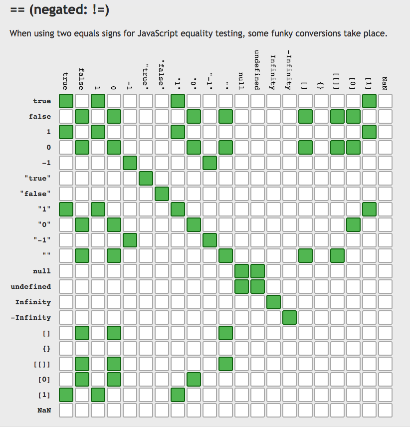

# 类型判断 
## 老问题 `== === ===`,`undefined == null`?
[JavaScript-Equality-Table](http://dorey.github.io/JavaScript-Equality-Table/)

```js
undefined == null // false
[] == [] // false
[1] == [1] // false
```


## js 类型
	- 基本类型：`String`、`Number`、`Boolean`、`Symbol`、`Undefined`、`Null` 
	- 引用类型：`Object`,`Function` 、`Array`、`RegExp`、`Date`
## `typeof foo` => `["number" | "boolean" | "symbol" | "string" | "object" | "undefined" | "function"]`
```js
typeof ''; // string 有效
typeof 1; // number 有效
typeof Symbol(); // symbol 有效
typeof true; //boolean 有效
typeof undefined; //undefined 有效
typeof null; //object 无效
typeof [] ; //object 无效
typeof new Function(); // function 有效
typeof new Date(); //object 无效
typeof new RegExp(); //object 无效


// !!!
typeof null; //object 无效
typeof new Function(); //function 有效
// `typeof`神奇的逻辑， 时而返回直接的类型，如除null外的基本类型，时而直接返回原型链的顶端`object`
```
## `instanceof`
## `constructor`
```js
function Foo() {}
Foo.prototype.constructor === Foo // true
(new Foo()).constructor === Foo // true

Foo.prototype.foo = {}
(new Foo()).constructor === Foo // true

Foo.prototype = {"foo":"foo"}
(new Foo()).constructor === Foo // false

undefined.constructor // TypeError: Cannot read property 'constructor' of undefined
null.constructor //=> TypeError: Cannot read property 'constructor' of null
```
## `toString`
```js
''.toString();  // ""
(1).toString();  // "1"
true.toString();  // "true"
Symbol("foo").toString();  // "Symbol(foo)"
undefined.toString();  // TypeError: Cannot read property 'toString' of undefined
null.toString();  // TypeError: Cannot read property 'toString' of null
(new Function()).toString();  // "function anonymous() {\n\n}"
(new Date()).toString();  // now
([]).toString();  // ""
(new RegExp()).toString();  // '/(?:)/'
(new Error("foo")).toString();  // 'Error: foo'
(document).toString();  // [object HTMLDocument]
(window).toString();  //[object global]
Object.prototype.toString.call('') ;   // [object String]
Object.prototype.toString.call(1) ;    // [object Number]
Object.prototype.toString.call(true) ; // [object Boolean]
Object.prototype.toString.call(Symbol()); //[object Symbol]
Object.prototype.toString.call(undefined) ; // [object Undefined]
Object.prototype.toString.call(null) ; // [object Null]
Object.prototype.toString.call(new Function()) ; // [object Function]
Object.prototype.toString.call(new Date()) ; // [object Date]
Object.prototype.toString.call([]) ; // [object Array]
Object.prototype.toString.call(new RegExp()) ; // [object RegExp]
Object.prototype.toString.call(new Error()) ; // [object Error]
Object.prototype.toString.call(document) ; // [object HTMLDocument]
Object.prototype.toString.call(window) ; //[object global]
```
## browser
### this
```html
<!doctype html>
<script>
this === window // true
</script>
```
### 黑域 let
```js
let x = x // Uncaught ReferenceError: x is not defined
x // Uncaught ReferenceError: x is not defined
let x = 1 // Uncaught SyntaxError: Identifier 'x' has already been declared
```
```html
<!doctype html>
<script>
function throws() { throw '!' }
let x = throws()
</script>
<script>
console.log(typeof x)
</script>
<script>
let x
</script>
```

# Object.defineProperty descriptor
- configurable: is the descriptor changeable
- enumerable
- value
- writable
- get
- set